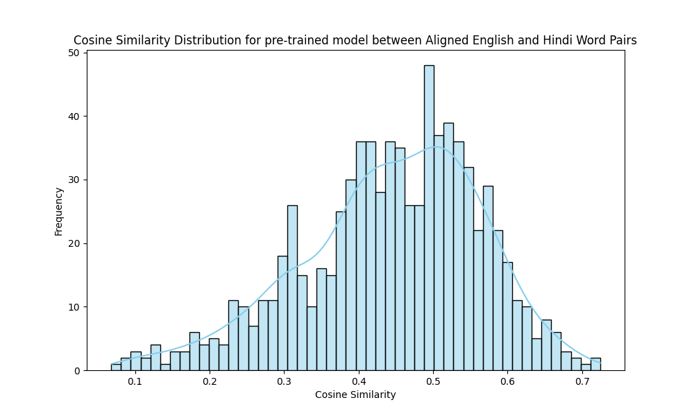
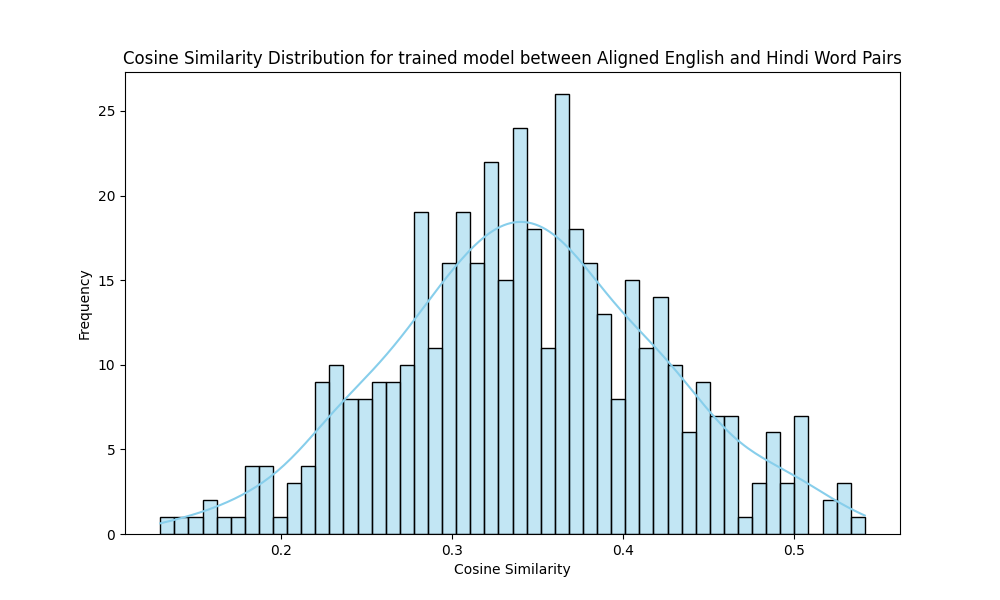

Here's an updated version of the documentation with a section on downloading the MUSE dataset for cross-lingual alignment and storing it in the `lexicon/` folder.

---

## **Overview**

This documentation provides a detailed guide to building a text embedding model from scratch using Wikipedia data. You'll first see the results from a trained FastText model, followed by step-by-step instructions on setting up the pipeline. The guide covers key processes such as downloading Wikipedia data, preprocessing text, and training your FastText model, or alternatively, using pre-trained FastText embeddings.

---

## **Results**

### **Performance Metrics**

The following table presents the Precision@K for the MUSE test dataset:

| **Model**               | **Precision@1** | **Precision@5** |
|-------------------------|-----------------|-----------------|
| Trained FastText         | 0.3464          | 0.5663          |
| Pre-trained FastText     | 0.3513          | 0.6206          |

While the pre-trained FastText model shows slightly better performance, the custom-trained model on Wikipedia data delivers competitive results. You can view detailed logs in `logs/alignment.log`.

### **Ablation Study**

An ablation study is conducted to observe the impact of dataset size on the performance of trained and pre-trained models. Here are the results:

| **Model**                     | **Precision@1 (%)** | **Precision@5 (%)** |
|-------------------------------|---------------------|---------------------|
| Trained FastText (5,000 words) | 0.0209              | 0.0405              |
| Trained FastText (10,000 words)| 0.2887              | 0.4595              |
| Trained FastText (20,000 words)| 0.3415              | 0.5799              |
| Pre-trained FastText (5,000)   | 0.2219              | 0.4587              |
| Pre-trained FastText (10,000)  | 0.3513              | 0.6100              |
| Pre-trained FastText (20,000)  | 0.3625              | 0.6306              |

### **Cosine Similarity Graph**

The cosine similarity graph below visualizes word vector similarities produced by the trained FastText model. This comparison between selected words and their nearest neighbors in the embedding space provides insights into the semantic relationships captured by the model.




---

## **Setting Up the Project**

### **Step 1: Clone the Repository**

Start by cloning the GitHub repository containing all the necessary scripts and configuration files:

```bash
git clone https://github.com/anshulsc/cross-lingual-alignment.git
cd cross-lingual-alignment
```

### **Step 2: Install Dependencies**

Next, install the required Python packages by running the following command:

```bash
pip install -r requirements.txt
```

Ensure that you have Python 3.x installed, along with `conda` for environment management if needed.

### **Step 3: Create Necessary Directories**

You need to set up directories to store raw, processed, and extracted data. Run the following commands to create the necessary folder structure:

```bash
mkdir -p data/raw
mkdir -p data/extracted
mkdir -p data/processed
mkdir -p embedding/trained
mkdir -p embedding/pretrained
mkdir -p lexicon
```

This structure ensures that all data files and trained models are organized appropriately.

---

## **Pipeline for Training FastText Embeddings**

### **1. Download Wikipedia Dumps**

The first step is to download Wikipedia data. Wikipedia dumps are large files that contain all the articles in a given language. Use the provided `wiki_download.py` script to automate the download process.

Run the following command to download the dump:

```bash
python vectorization/wiki_download.py
```

The dumps will be saved in the `data/raw/` directory:

```
data/raw/hiwiki-latest-pages-articles.xml.bz2  # Hindi Wikipedia dump
data/raw/enwiki-latest-pages-articles.xml.bz2  # English Wikipedia dump
```

---

### **2. Extract Articles from Wikipedia Dumps**

Once the Wikipedia dump is downloaded, you'll need to extract articles from the XML format using WikiExtractor.

1. **Install WikiExtractor**:
   
   ```bash
   pip install wikiextractor
   ```

2. **Run WikiExtractor** to extract plain text and store the result in the `data/extracted/` directory:

   ```bash
   wikiextractor -o data/extracted/extracted_hi --json --no-templates data/raw/hiwiki-latest-pages-articles.xml.bz2
   ```

Alternatively, you can run the `extract_articles.py` script to automate this process:

```bash
python vectorization/extract_articles.py
```

The extracted articles will be saved in `.txt` format in the `data/processed/` directory:

```
data/processed/final_en.txt
data/processed/final_hi.txt
```

---

### **3. Preprocess Extracted Text**

Before training the model, the extracted articles must be preprocessed. This step involves cleaning the text, such as removing HTML tags, punctuation, and stopwords, as well as tokenizing the text.

Run the `preprocess_text.py` script to clean and preprocess the data:

```bash
python vectorization/preprocess_text.py
```

The preprocessed text will be saved in the `data/processed/` directory:

```
data/processed/preprocessed_en.txt
```

---

### **4. Train the FastText Model**

With the preprocessed data, you're now ready to train the FastText model. This model is efficient for capturing subword information, making it particularly useful for languages with rich morphology.

Run the `train_embedding.py` script to train the FastText model:

```bash
python vectorization/train_embedding.py
```

The trained embedding model will be saved in the `embedding/trained/` directory:

```
embedding/trained/fasttext_hi.bin
```

---

## **Using Pretrained FastText Embeddings**

If you'd prefer to use pre-trained embeddings, you can download them and store the embeddings in the `embedding/pretrained/` directory. Pretrained embeddings can then be used directly in your tasks without the need for further training.

---

## **Download MUSE Dataset for Cross-Lingual Alignment**

The next step involves downloading the MUSE dataset, which provides bilingual dictionaries for training and testing cross-lingual alignment.

1. Download the MUSE dataset (English-Hindi bilingual lexicon) from the official [MUSE GitHub repository](https://github.com/facebookresearch/MUSE).

2. Download the bilingual lexicon for **English-Hindi** and store it in the `lexicon/` folder:

```bash
wget https://dl.fbaipublicfiles.com/arrival/dictionaries/en-hi.txt -P lexicon/
```

3. Similarly, download the **test** dictionary and store it in the same folder:

```bash
wget https://dl.fbaipublicfiles.com/arrival/dictionaries/en-hi.5000-6500.txt -P lexicon/
```
Rename it to `en-hi.test.txt`
The `lexicon/` folder should now contain the following files:

```
lexicon/en-hi.txt       # Full dictionary for training
lexicon/en-hi.test.txt  # Test dictionary
```

---

## **Directory Structure**

Below is the recommended directory structure for the project:

```
/project-root
│
├── /data/                    # Store raw, extracted, and processed data
│   ├── /raw/                 # Raw Wikipedia dumps
│   ├── /extracted/           # Extracted Wikipedia articles
│   └── /processed/           # Preprocessed text data
│
├── /embedding/               # Store trained and pre-trained embeddings
│   └── /trained/             # Trained embedding models
│   └── /pretrained/          # Pre-trained embedding models
│
├── /lexicon/                 # Store bilingual lexicons
│   ├── en-hi.txt             # English-Hindi bilingual lexicon (train)
│   └── en-hi.test.txt        # English-Hindi test lexicon
│
├── /vectorization/           # Python scripts for each step
│   ├── wiki_download.py      # Download Wikipedia dumps
│   ├── extract_articles.py   # Extract articles from the dump
│   ├── preprocess_text.py    # Preprocess and clean text
│   └── train_embedding.py    # Train FastText embedding model
│
├── /cross-align/             # Cross-lingual alignment and evaluation scripts
│   ├── alignment.py
│   ├── data_loader.py
│   ├── evaluation.py
│
├── config/config.yaml        # Configuration file for paths, parameters
├── README.md                 # Project documentation
└── requirements.txt          # Python dependencies
```

---

## **Cross-Lingual Alignment**

To perform cross-lingual alignment with trained or pre-trained models, you can use the command-line interface. For trained models, use the following command:

```bash
python main.py --trained
```

To use pre-trained models (default behavior):

```bash
python main.py
```

This command-line argument provides flexibility in selecting between trained and pre-trained models based on your needs.

---

## **Next Steps**

1. **Experimentation**: Try different text preprocessing techniques (e.g., stemming or lemmatization) to improve results.
2. **Explore Other Models**

: Train and compare alternative embedding models like GloVe or Word2Vec to analyze performance differences.
3. **Apply to Downstream Tasks**: Use the trained embeddings for tasks such as clustering, classification, or semantic similarity analysis.
